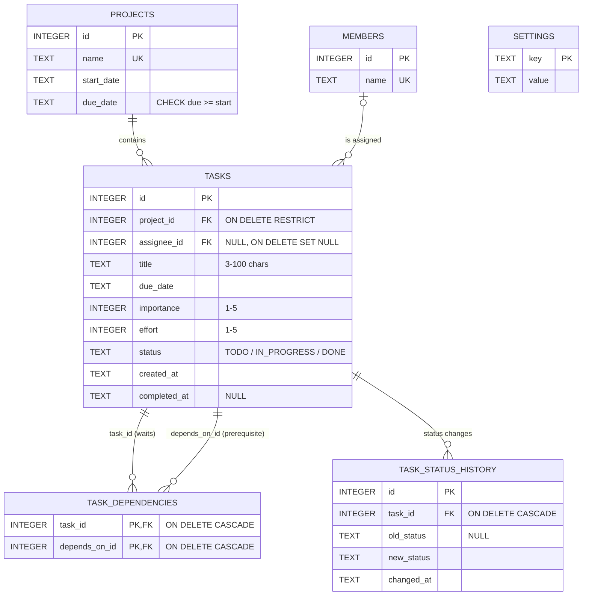

# ER Diagram — TaskMind

```mermaid
erDiagram
    PROJECTS ||--o{ TASKS : contains
    MEMBERS  |o--o{ TASKS : "is assigned"
    TASKS    ||--o{ TASK_DEPENDENCIES : "task_id (waits)"
    TASKS    ||--o{ TASK_DEPENDENCIES : "depends_on_id (prerequisite)"
    TASKS    ||--o{ TASK_STATUS_HISTORY : "status changes"

    PROJECTS {
        INTEGER id PK
        TEXT name UK
        TEXT start_date
        TEXT due_date "CHECK due >= start"
    }
    MEMBERS {
        INTEGER id PK
        TEXT name UK
    }
    TASKS {
        INTEGER id PK
        INTEGER project_id FK "ON DELETE RESTRICT"
        INTEGER assignee_id FK "NULL, ON DELETE SET NULL"
        TEXT title "3-100 chars"
        TEXT due_date
        INTEGER importance "1-5"
        INTEGER effort "1-5"
        TEXT status "TODO / IN_PROGRESS / DONE"
        TEXT created_at
        TEXT completed_at "NULL"
    }
    TASK_DEPENDENCIES {
        INTEGER task_id PK,FK "ON DELETE CASCADE"
        INTEGER depends_on_id PK,FK "ON DELETE CASCADE"
    }
    TASK_STATUS_HISTORY {
        INTEGER id PK
        INTEGER task_id FK "ON DELETE CASCADE"
        TEXT old_status "NULL"
        TEXT new_status
        TEXT changed_at
    }
    SETTINGS {
        TEXT key PK
        TEXT value
    }
```
